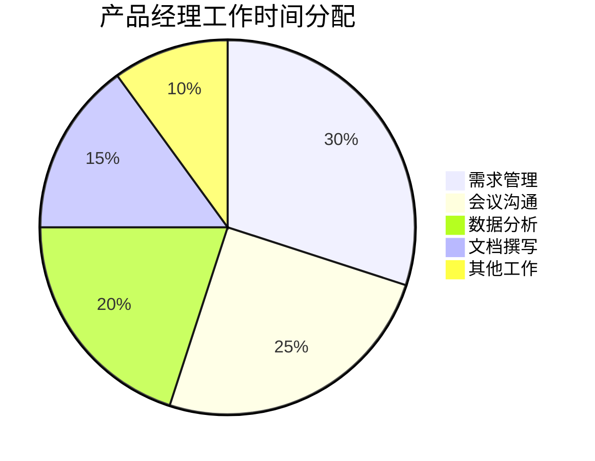

# 产品经理岗位职责

## 一、岗位概述

产品经理是负责产品的规划、设计、开发和运营的核心角色。

## 二、主要职责

### 2.1 产品规划

产品经理最核心的职责是打造优秀的产品,为用户创造价值,为企业创造收益。具体可以分为以下几个方面:

### 2.1.1 产品战略规划

产品经理需要制定产品战略,确定产品方向。这包括:

1. **市场洞察**
- 市场趋势研究
- 竞品分析
- 用户研究
- 商业模式分析

2. **产品规划**
- 产品定位
- 目标用户群
- 核心价值主张
- 商业变现模式

### 2.1.2 产品研发管理

负责产品从概念到落地的整个过程:

1. **需求管理**
- 需求收集与分析
- 需求优先级排序
- 需求文档撰写
- 原型设计

2. **开发协作**
- 与研发团队沟通
- 把控开发进度
- 质量验收
- 版本迭代

### 2.1.3 数据运营分析

通过数据驱动产品决策:

1. **数据监控**
- 核心指标跟踪
- 用户行为分析
- 转化漏斗分析
- 留存分析

2. **优化改进**
- 提出优化方案
- A/B测试
- 效果评估
- 持续迭代

### 2.2 一个产品经理的真实工作案例

以下是我负责的一个社交产品用户增长项目:

### 2.2.1 项目背景
- DAU增长停滞
- 新用户留存率低
- 用户活跃度下降

### 2.2.2 工作过程

1. **问题诊断**
- 分析用户行为数据
- 进行用户访谈(30+用户)
- 竞品调研(分析5家竞品)

2. **方案设计**
- 新手引导优化
- 社交链建立机制改版
- 内容推荐算法优化
- 激励机制调整

3. **执行落地**
- 跨部门协调(产品、设计、研发、运营)
- 分期实施
- 数据监控
- 及时调整

### 2.2.3 项目成果
- DAU提升40%
- 新用户次日留存提升15%
- 用户平均使用时长增加20分钟

### 2.3 产品经理的日常工作职责

### 2.3.1 工作内容分布

### 2.3.2 典型一周工作安排

**周一：**
- 晨会：团队周计划对齐
- 需求评审会
- 数据周报分析

**周二：**
- 用户访谈
- PRD编写
- 与设计讨论方案

**周三：**
- 开发进度跟进
- 新功能测试
- 数据分析

**周四：**
- 版本发布
- 效果监控
- 优化方案讨论

**周五：**
- 周会：进度总结
- 下周计划制定
- 文档整理

### 2.4 不同类型产品经理的职责差异

### 2.4.1 To B产品经理
- 重点关注客户需求
- 业务流程梳理
- 系统功能设计
- 项目交付管理

### 2.4.2 To C产品经理
- 用户体验优化
- 功能创新
- 运营数据分析
- 市场竞争分析

### 2.4.3 平台型产品经理
- 平台规则设计
- 生态建设
- 商业模式优化
- 多方利益平衡

### 2.5 常见误区与建议

### 2.5.1 职责误区
1. **全能误区**
以为产品经理要精通所有领域

2. **权力误区**
认为可以命令所有人

3. **边界误区**
职责范围不清晰

### 2.5.2 实践建议
1. **明确职责边界**
- 了解岗位说明书
- 与上级明确预期
- 与协作方对齐职责

2. **建立工作方法**
- 建立个人工作流程
- 善用工具提高效率
- 持续总结复盘

3. **注重能力提升**
- 补齐短板
- 发挥优势
- 持续学习
