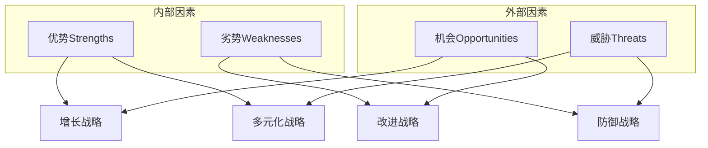
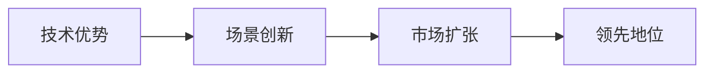
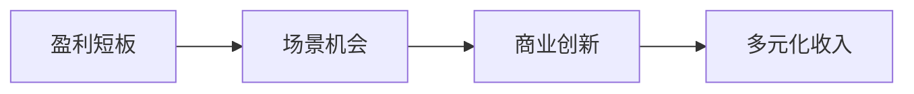
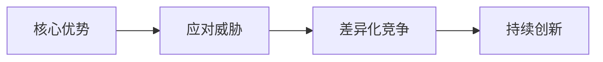
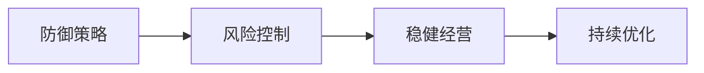

# SWOT分析：产品战略决策的基石

## 一、SWOT分析概述

### 1.1 什么是SWOT分析？

SWOT分析是一种战略规划工具，用于评估项目或商业企业的：
- Strengths（优势）：内部积极因素
- Weaknesses（劣势）：内部消极因素
- Opportunities（机会）：外部积极因素
- Threats（威胁）：外部消极因素

### 1.2 SWOT分析框架



## 二、SWOT分析方法论

### 2.1 分析步骤

1. **收集信息**
   - 内部评估
   - 外部调研
   - 数据分析

2. **识别要素**
   - 明确优势
   - 找出劣势
   - 发现机会
   - 预警威胁

3. **制定策略**
   - SO策略（优势+机会）
   - WO策略（劣势+机会）
   - ST策略（优势+威胁）
   - WT策略（劣势+威胁）

### 2.2 分析维度

| 维度 | 关注点 | 分析方法 |
|------|--------|----------|
| 优势 | • 核心竞争力\n• 品牌价值\n• 资源优势 | • 内部评估\n• 竞品对比\n• 用户反馈 |
| 劣势 | • 能力短板\n• 资源不足\n• 效率问题 | • 问题分析\n• 数据监测\n• 用户投诉 |
| 机会 | • 市场需求\n• 技术革新\n• 政策支持 | • 市场研究\n• 趋势分析\n• 政策解读 |
| 威胁 | • 竞争压力\n• 环境变化\n• 风险因素 | • 竞争分析\n• 风险评估\n• 环境扫描 |

## 三、SWOT分析实战案例

### 3.1 移动支付产品SWOT分析

#### 案例：某移动支付产品的SWOT分析

```mermaid
quadrant
    title 移动支付产品SWOT分析
    x-axis 内部因素 --> 外部因素
    y-axis 消极因素 --> 积极因素
    quadrant-1 技术领先
    quadrant-1 用户基础
    quadrant-1 品牌影响力
    quadrant-2 获客成本高
    quadrant-2 盈利模式单一
    quadrant-2 安全风险
    quadrant-3 市场扩张
    quadrant-3 场景创新
    quadrant-3 技术革新
    quadrant-4 监管政策
    quadrant-4 竞争加剧
    quadrant-4 信任危机
```

#### 1. 优势（Strengths）
- 技术领先：领先的支付技术和安全体系
- 用户基础：庞大的用户群体和高频使用场景
- 品牌影响力：市场认可度高，用户信任度强

#### 2. 劣势（Weaknesses）
- 获客成本高：新用户获取成本持续上升
- 盈利模式单一：主要依赖交易手续费
- 安全风险：面临诈骗、资金安全等挑战

#### 3. 机会（Opportunities）
- 市场扩张：下沉市场和海外市场机会
- 场景创新：新零售、智慧城市等场景融合
- 技术革新：区块链、生物识别等新技术应用

#### 4. 威胁（Threats）
- 监管政策：支付行业监管趋严
- 竞争加剧：新竞争者不断涌入
- 信任危机：行业负面事件影响

### 3.2 战略制定

#### SO战略（增长型）


1. 利用技术优势开发创新场景
2. 扩大用户基础进入新市场
3. 强化品牌影响力

#### WO战略（改进型）


1. 开发新的盈利模式
2. 优化获客策略
3. 加强风险控制

#### ST战略（多元化）


1. 技术创新应对竞争
2. 合规经营应对监管
3. 品牌建设提升信任

#### WT战略（防御型）


1. 完善风控体系
2. 优化成本结构
3. 稳固核心业务

## 四、SWOT分析的应用场景

### 4.1 产品规划

1. **新产品立项**
   - 市场机会评估
   - 竞争力分析
   - 风险评估

2. **产品升级**
   - 现状诊断
   - 方向判断
   - 策略制定

3. **市场拓展**
   - 市场评估
   - 竞争分析
   - 策略规划

### 4.2 战略决策

1. **业务战略**
   ```mermaid
   graph TD
       A[SWOT分析] --> B[战略选择]
       B --> C1[扩张战略]
       B --> C2[防御战略]
       B --> C3[转型战略]
       B --> C4[撤退战略]
   ```

2. **投资决策**
   - 项目可行性
   - 风险评估
   - 收益预测

3. **合作决策**
   - 伙伴评估
   - 协同分析
   - 风险控制

## 五、SWOT分析的注意事项

### 5.1 常见误区

1. **分析过于表面**
   - 缺乏深入调研
   - 忽视关键因素
   - 结论过于笼统

2. **主观性过强**
   - 过度乐观
   - 选择性忽视
   - 经验主义

3. **静态分析**
   - 忽视动态变化
   - 缺乏前瞻性
   - 应对不及时

### 5.2 最佳实践

1. **保持客观**
   - 多方数据验证
   - 避免主观臆断
   - 全面系统分析

2. **动态更新**
   - 定期复盘
   - 持续跟踪
   - 及时调整

3. **落地执行**
   - 制定行动计划
   - 分配资源
   - 跟踪效果

## 六、实战练习

### 练习一：社交产品SWOT分析

要求：
1. 选择一个主流社交产品
2. 进行完整的SWOT分析
3. 制定相应的战略举措
4. 设计执行方案
5. 评估预期效果

### 练习二：创新项目评估

步骤：
1. 项目背景描述
2. SWOT要素分析
3. 战略方案设计
4. 可行性论证
5. 风险应对计划

## 七、总结

SWOT分析是产品经理必备的战略分析工具，关键是要：
1. 全面系统思考
2. 客观准确判断
3. 动态持续更新
4. 落地执行到位
5. 及时评估调整

成功的SWOT分析应该：
- 基于充分的数据支持
- 结合实际情况
- 形成可执行的策略
- 带来实际的业务价值
- 指导产品发展方向