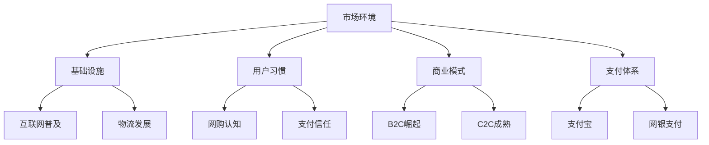
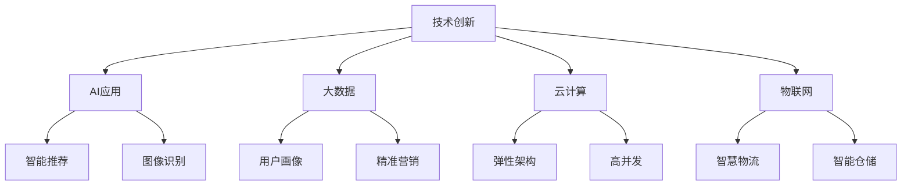

# 中国电商行业发展历程

> 远哥说：作为一名电商产品经理，了解行业发展历程非常重要。我在电商行业打拼了十多年，经历了从PC电商到移动电商，从传统电商到社交电商的变迁。今天和大家分享下中国电商行业的发展历程。

## 一、萌芽期（1995-2002）

### 1.1 主要事件
```
标志性事件：
- 1995年：中国第一家网上商店"8848"成立
- 1999年：阿里巴巴、当当网成立
- 2000年：淘宝网、京东成立
- 2002年：支付宝成立

行业特点：
1. 以B2B为主
2. 基础设施不完善
3. 用户认知度低
4. 支付环境待改善
```

### 1.2 典型案例
| 公司 | 创立时间 | 初始模式 | 代表意义 |
|------|----------|----------|----------|
| 阿里巴巴 | 1999年 | B2B平台 | 开创中国电商先河 |
| 当当网 | 1999年 | B2C图书 | 首家在线图书商城 |
| 京东 | 2000年 | 线下配件店 | 开创自营电商模式 |
| 易趣 | 2000年 | C2C平台 | 引入在线支付理念 |

## 二、发展期（2003-2008）

### 2.1 市场环境


### 2.2 重要进展
> 远哥说：这个阶段我正好在淘宝工作，见证了C2C模式的崛起，也经历了电商信任体系的建立过程。

```
关键突破：
- 支付环境改善
  * 支付宝担保交易
  * 网银支付普及
  * 第三方支付崛起

- 物流体系完善
  * 快递公司发展
  * 仓储网络建设
  * 配送体系优化

- 用户习惯养成
  * 网购认知提升
  * 支付信任建立
  * 购物体验改善
```

## 三、爆发期（2009-2014）

### 3.1 市场格局
```
平台电商：
- 淘宝/天猫：C2C到B2C的转型
- 京东：自营到平台的扩展
- 唯品会：特卖模式的创新
- 聚美优品：垂直细分市场

创新模式：
1. 团购模式：美团、拼多多
2. 闪购模式：聚美优品
3. 跨境电商：洋码头
4. O2O模式：美团、饿了么
```

### 3.2 发展特征
| 特征 | 表现 | 影响 | 案例 |
|------|------|------|------|
| 移动化 | 移动端崛起 | 购物场景延伸 | 手机淘宝 |
| 社交化 | 社交电商兴起 | 传播方式变革 | 微信商城 |
| 本地化 | O2O模式发展 | 线上线下融合 | 美团外卖 |
| 精细化 | 垂直领域深耕 | 用户需求细分 | 小红书 |

## 四、创新期（2015-2020）

### 4.1 新模式涌现
```
社交电商：
- 拼多多：社交拼团
- 小红书：种草社区
- 微信商城：私域流量
- 抖音电商：短视频带货

创新特点：
1. 内容+电商
2. 社交+电商
3. 直播+电商
4. 短视频+电商
```

### 4.2 技术创新
> 远哥说：这个阶段我负责过社交电商项目，深刻体会到技术创新带来的变革。



## 五、整合期（2021至今）

### 5.1 行业趋势
```
发展方向：
- 数字化转型
- 智能化升级
- 供应链革新
- 用户体验提升

挑战机遇：
1. 流量红利消退
2. 获客成本上升
3. 监管政策收紧
4. 技术创新加速
```

### 5.2 未来展望
| 领域 | 趋势 | 机会 | 挑战 |
|------|------|------|------|
| 技术创新 | AI+IoT融合 | 智能化升级 | 技术门槛 |
| 商业模式 | 数字化转型 | 效率提升 | 转型成本 |
| 用户体验 | 场景融合 | 体验升级 | 技术实现 |
| 供应链 | 智能供应链 | 成本优化 | 系统复杂性 |

## 六、经验总结

### 6.1 核心洞察
> 远哥说：回顾这些年的电商发展，我总结了几点重要经验：

```
发展规律：
1. 用户为本
   - 用户需求驱动
   - 体验持续优化
   - 场景不断延伸

2. 效率至上
   - 供应链优化
   - 物流提速
   - 成本控制

3. 创新制胜
   - 模式创新
   - 技术创新
   - 服务创新

4. 价值为王
   - 商业价值
   - 用户价值
   - 社会价值
```

### 6.2 产品启示
```
产品思维：
- 用户需求洞察
- 场景体验设计
- 商业模式创新
- 技术赋能升级

发展方向：
1. 智能化升级
2. 场景化延伸
3. 生态化布局
4. 价值链整合
```

## 七、实践建议

### 7.1 能力建设
```
核心能力：
- 用户洞察
- 商业分析
- 产品设计
- 运营能力
- 数据分析
- 项目管理

提升方向：
1. 行业认知
2. 专业技能
3. 管理能力
4. 创新思维
```

### 7.2 发展建议
| 阶段 | 重点 | 方法 | 资源 |
|------|------|------|------|
| 入门期 | 基础知识 | 系统学习 | 专业课程 |
| 成长期 | 实战经验 | 项目实践 | 导师指导 |
| 提升期 | 创新能力 | 主导项目 | 行业交流 |
| 专家期 | 战略思维 | 跨界整合 | 资源整合 |
