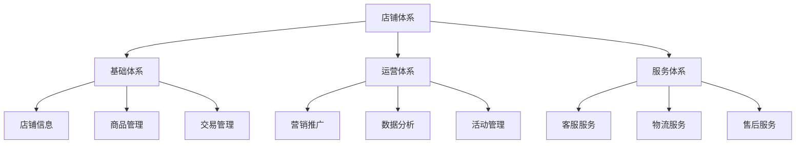
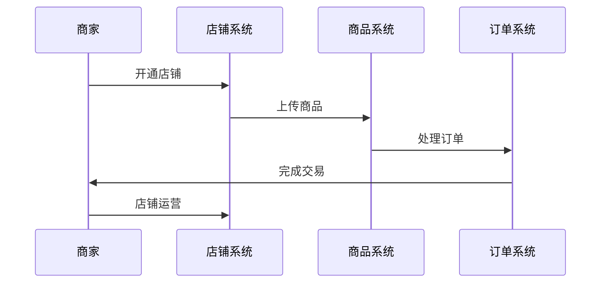
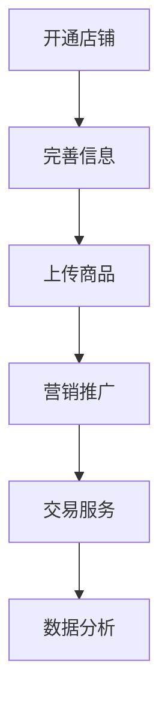
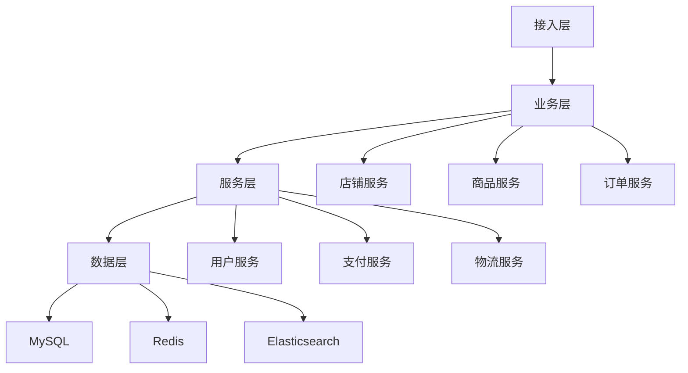

# 电商店铺体系设计

> 远哥说：店铺体系是电商平台的商家经营体系，它直接影响商家的经营效果和平台生态。这里我结合多个电商平台的实践经验，分享店铺体系的设计方法。

## 一、产品定义

### 1.1 业务价值
```
核心价值：
1. 商家价值
   - 经营效率：提升经营效率
   - 销售转化：提升销售转化
   - 品牌建设：助力品牌建设

2. 用户价值
   - 购物体验：优质的购物体验
   - 服务保障：完善的服务保障
   - 商品选择：丰富的商品选择

3. 平台价值
   - 生态建设：完善平台生态
   - 规模效应：形成规模效应
   - 可持续性：保证可持续性
```

### 1.2 设计原则
| 原则 | 说明 | 正确示范 | 错误示范 |
|------|------|----------|----------|
| 标准化 | 规范标准 | 统一标准 | 标准混乱 |
| 差异化 | 特色经营 | 差异定位 | 同质竞争 |
| 专业化 | 专业服务 | 专业运营 | 粗放经营 |
| 规范化 | 规范运营 | 合规经营 | 违规操作 |

## 二、系统设计

### 2.1 店铺架构


### 2.2 店铺流程


## 三、功能设计

### 3.1 核心功能
```
功能模块：
1. 基础体系
   - 店铺信息：店铺基础信息
   - 商品管理：商品信息管理
   - 交易管理：订单交易管理
   - 资产管理：店铺资产管理

2. 运营体系
   - 营销推广：营销活动推广
   - 数据分析：经营数据分析
   - 活动管理：店铺活动管理
   - 会员管理：店铺会员管理

3. 服务体系
   - 客服服务：客户服务管理
   - 物流服务：物流配送服务
   - 售后服务：售后服务管理
   - 评价管理：店铺评价管理

4. 管理体系
   - 权限管理：店铺权限管理
   - 人员管理：店铺人员管理
   - 财务管理：店铺财务管理
   - 考核管理：店铺考核管理
```

### 3.2 场景示例
| 场景 | 需求 | 解决方案 | 效果 |
|------|------|----------|------|
| 开店入驻 | 快速开店 | 标准流程 | 效率高 |
| 商品管理 | 商品运营 | 智能工具 | 体验好 |
| 订单处理 | 订单管理 | 自动化处理 | 效率高 |
| 客户服务 | 服务保障 | 专业服务 | 满意度高 |

## 四、交互设计

### 4.1 店铺流程


### 4.2 页面设计
```
页面布局：
1. 店铺中心
   - 店铺概况
   - 店铺设置
   - 店铺装修
   - 店铺管理

2. 商品中心
   - 商品管理
   - 类目管理
   - 库存管理
   - 定价管理

3. 交易中心
   - 订单管理
   - 物流管理
   - 售后管理
   - 评价管理

4. 运营中心
   - 营销管理
   - 活动管理
   - 数据分析
   - 会员管理
```

## 五、数据分析

### 5.1 核心指标
| 维度 | 指标 | 目标 | 分析 |
|------|------|------|------|
| 规模 | 经营规模 | 提高规模 | 规模分析 |
| 效率 | 经营效率 | 提升效率 | 效率分析 |
| 质量 | 经营质量 | 提升质量 | 质量分析 |
| 成本 | 经营成本 | 优化成本 | 成本分析 |

### 5.2 效果分析
```
分析维度：
1. 规模分析
   - 商品规模
   - 交易规模
   - 用户规模
   - 收入规模

2. 效率分析
   - 运营效率
   - 服务效率
   - 物流效率
   - 转化效率

3. 价值分析
   - 店铺价值
   - 商品价值
   - 会员价值
   - 长期价值
```

## 六、技术架构

### 6.1 系统架构


### 6.2 技术选型
| 技术 | 应用 | 方案 | 说明 |
|------|------|------|------|
| 存储 | 店铺存储 | MySQL集群 | 主从架构 |
| 缓存 | 店铺缓存 | Redis集群 | 高性能 |
| 搜索 | 店铺搜索 | Elasticsearch | 实时搜索 |
| 消息 | 店铺消息 | RocketMQ | 消息队列 |

## 七、案例分析

### 7.1 案例一：淘宝店铺
```
案例要点：
1. 业务特点
   - 规模大
   - 品类全
   - 体验好

2. 解决方案
   - 标准化运营
   - 智能化工具
   - 专业化服务

3. 实施效果
   - 规模效应好
   - 运营效率高
   - 服务体验好
```

### 7.2 案例二：京东店铺
| 特点 | 挑战 | 方案 | 效果 |
|------|------|------|------|
| 自营模式 | 库存管理 | 智能仓储 | 效率高 |
| 品质保证 | 质量管理 | 标准体系 | 品质好 |
| 物流服务 | 配送效率 | 智能物流 | 时效好 |
| 售后保障 | 服务体验 | 标准服务 | 体验好 |
